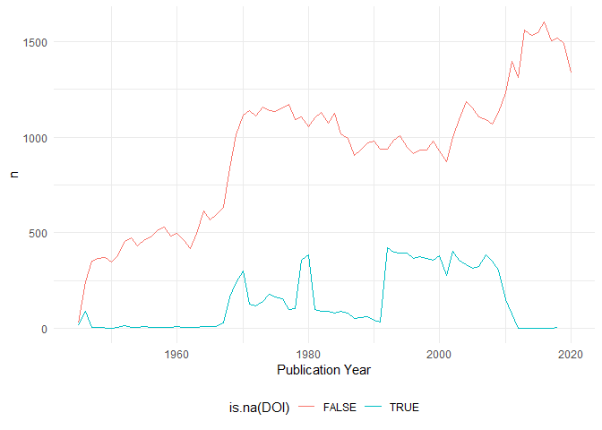
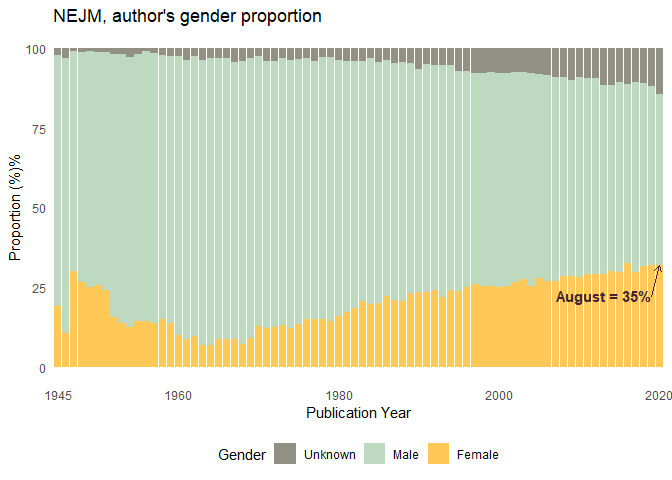
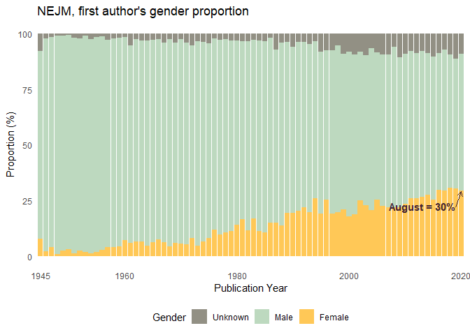
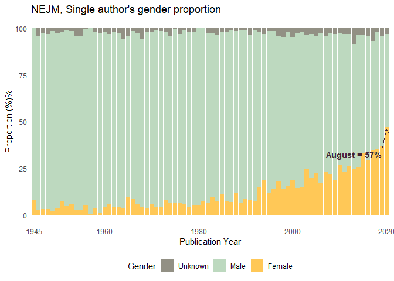

## Gender proportions in NEJM

The following analysis was inspired by the work of Megan Frederickson,
“Covid-19’s gendered impact on academia productivity” available
[here](https://github.com/drfreder/pandemic-pub-bias/blob/master/README.md).

Data was collected from all publications registered in pubmed, from the
New England Journal of Medicine, from 1945 to 2020. (Raw data available
at
[01\_data](https://github.com/palolili23/pubmed_webscrap/tree/master/01_data/nejm))

Since all publications only had first name initials, I used the package
[rcrossref](https://github.com/ropensci/rcrossref), function `cr_cn`,
which gets citation in various formats from CrossRef and only requires
the DOI. Before pulling the citations, I [registered for the Polite
Pool](https://github.com/ropensci/rcrossref#register-for-the-polite-pool)
as good practices, and requires setting my email account in the
Renviron. I used the `cr_cn` with the default setting, which pulls
article data in [bibtex](https://en.wikipedia.org/wiki/BibTeX) format,
which has complete names for all authors. The code for this step can be
found in
[`02_r/extract_bib`](https://github.com/palolili23/pubmed_webscrap/blob/master/02_r/extract_bib.R).
I did it in batches of \~10000 and saved the new dataframes with the
bibtex data as .Rda, they can be found at
[01b\_clean\_data/nejm](https://github.com/palolili23/pubmed_webscrap/tree/master/01b_clean_data/nejm).

Once all papers had their bibtex information, I followed the next steps
to clean the data:

``` r
library(tidyverse)
```

#### Steps to import the data:

``` r
data_dir <- "01b_clean_data/nejm"

rda_files <- fs::dir_ls(data_dir, regexp = "\\.Rda$")

data <- rda_files %>% 
  map_dfr(rio::import)

data <- data %>% 
  distinct(PMID, .keep_all = TRUE)

data %>% 
  select(DOI, bib) %>% 
  sample_n(3) %>% 
  mytable()
```

<table class="table table-hover table-condensed table-responsive" style="font-size: 12px; width: auto !important; margin-left: auto; margin-right: auto;">

<thead>

<tr>

<th style="text-align:left;">

DOI

</th>

<th style="text-align:left;">

bib

</th>

</tr>

</thead>

<tbody>

<tr>

<td style="text-align:left;">

10.1056/nejm197708112970616

</td>

<td style="text-align:left;">

@article{1977, doi = {10.1056/nejm197708112970616}, url =
{<https://doi.org/10.1056%2Fnejm197708112970616>}, year = 1977, month =
{aug}, publisher = {Massachusetts Medical Society}, volume = {297},
number = {6}, pages = {337–337}, title = {Febrile Reactions to {INH}},
journal = {New England Journal of Medicine} }

</td>

</tr>

<tr>

<td style="text-align:left;">

10.1056/NEJM199904083401402

</td>

<td style="text-align:left;">

@article{Martin\_1999, doi = {10.1056/nejm199904083401402}, url =
{<https://doi.org/10.1056%2Fnejm199904083401402>}, year = 1999, month =
{apr}, publisher = {Massachusetts Medical Society}, volume = {340},
number = {14}, pages = {1063–1070}, author = {Daniel F. Martin and
Baruch D. Kuppermann and Richard A. Wolitz and Alan G. Palestine and
Hong Li and Charles A. Robinson}, title = {Oral Ganciclovir for Patients
with Cytomegalovirus Retinitis Treated with a Ganciclovir Implant},
journal = {New England Journal of Medicine} }

</td>

</tr>

<tr>

<td style="text-align:left;">

10.1056/NEJMp020184

</td>

<td style="text-align:left;">

@article{Noguchi\_2003, doi = {10.1056/nejmp020184}, url =
{<https://doi.org/10.1056%2Fnejmp020184>}, year = 2003, month = {jan},
publisher = {Massachusetts Medical Society}, volume = {348}, number =
{3}, pages = {193–194}, author = {Philip Noguchi}, title = {Risks and
Benefits of Gene Therapy}, journal = {New England Journal of Medicine} }

</td>

</tr>

</tbody>

</table>

#### Extract authors name and make as many rows as authors, per paper

``` r
# Create an author variable from the bibtex
data <- data %>% mutate(
  author = str_extract(bib, "(author = \\{)(.)+"),
  author = str_remove(author, "author = \\{"),
  author = str_remove(author, "\\},")
)

## Separate authors into multiple columns using the split_into_multiple function. 
## Create as many rows as authors for each paper using pivot_longer

split_into_multiple <- function(column, pattern = ", ", into_prefix){
  cols <- str_split_fixed(column, pattern, n = Inf)
  cols[which(cols == "")] <- NA
  cols <- as_tibble(cols)
  m <- dim(cols)[2]
  
  names(cols) <- paste(into_prefix, 1:m, sep = "_")
  return(cols)
}

data_authors <- data %>% 
  bind_cols(split_into_multiple(data$author, " and ", "author")) %>% 
  pivot_longer(
    cols = starts_with("author_"),
    names_to = "author_position",
    values_to = "author_name",
    names_prefix = "author_") %>% 
  drop_na(author_name)


# Some authors only have initials instead of complete first names, these will be excluded
# Separate first and last name

data_authors <- data_authors %>% 
  mutate(author_clean = str_remove_all(author_name, "[:upper:][:punct:]"),
         author_clean = str_trim(author_clean, side = "both")) %>% 
  separate(author_clean, into = c("first_name", "last_name"), fill = "left")

data_filtered <- data_authors %>% 
  drop_na(first_name) 

data_filtered %>% 
filter(DOI == "10.1056/nejm194511152332004") %>% 
  select(author_position, author_name, first_name, last_name) %>% 
  mytable()
```

<table class="table table-hover table-condensed table-responsive" style="font-size: 12px; width: auto !important; margin-left: auto; margin-right: auto;">

<thead>

<tr>

<th style="text-align:left;">

author\_position

</th>

<th style="text-align:left;">

author\_name

</th>

<th style="text-align:left;">

first\_name

</th>

<th style="text-align:left;">

last\_name

</th>

</tr>

</thead>

<tbody>

<tr>

<td style="text-align:left;">

1

</td>

<td style="text-align:left;">

Elliot L. Sagall

</td>

<td style="text-align:left;">

Elliot

</td>

<td style="text-align:left;">

Sagall

</td>

</tr>

<tr>

<td style="text-align:left;">

2

</td>

<td style="text-align:left;">

Albert Dorfman

</td>

<td style="text-align:left;">

Albert

</td>

<td style="text-align:left;">

Dorfman

</td>

</tr>

</tbody>

</table>

#### Find gender for each author

To identify the gender of each author, I use the [`gender`
package](https://github.com/ropensci/gender), by Mullen, L. (2019).
gender: Predict Gender from Names Using Historical Data. R package
version 0.5.3 and the U.S. Social Security Administration baby names
database. To use the `gender` function, the package asks to download the
`genderdata` package, but installation can be tricky as discussed in
this [post](github.com/ropensci/drat/issues/6). I downloaded the package
using `devtools::install_github("ropensci/genderdata")` command.

*Considerations*: This package attempts to infer gender (or more
precisely, sex assigned at birth) based on first names using historical
data. This method has many limitations as discussed
[here](https://github.com/ropensci/gender#guidelines-and-warnings),
which include its reliance of data created by the state and its
inability to see beyond the state-imposed gender binary and is meant to
be used for studying populations in the aggregate. This method is a
rough approach and can missclassify gender or exclude individual
authors, but it can give a picture of the gender bias within the large
dataset.

``` r
names <- data_filtered %>% count(first_name) %>% pull(first_name)

gender <- gender::gender(names, method = "ssa")

data_filtered <- data_filtered %>% 
  left_join(gender, by = c("first_name" = "name")) %>% 
  select(-starts_with("proportion"),
         -starts_with("year"))

data_filtered %>% 
  select(first_name, gender) %>% 
  group_by(gender) %>% 
  sample_n(3) %>% 
  mytable()
```

<table class="table table-hover table-condensed table-responsive" style="font-size: 12px; width: auto !important; margin-left: auto; margin-right: auto;">

<thead>

<tr>

<th style="text-align:left;">

first\_name

</th>

<th style="text-align:left;">

gender

</th>

</tr>

</thead>

<tbody>

<tr>

<td style="text-align:left;">

Mari

</td>

<td style="text-align:left;">

female

</td>

</tr>

<tr>

<td style="text-align:left;">

Tanya

</td>

<td style="text-align:left;">

female

</td>

</tr>

<tr>

<td style="text-align:left;">

Maria

</td>

<td style="text-align:left;">

female

</td>

</tr>

<tr>

<td style="text-align:left;">

Gregory

</td>

<td style="text-align:left;">

male

</td>

</tr>

<tr>

<td style="text-align:left;">

Robert

</td>

<td style="text-align:left;">

male

</td>

</tr>

<tr>

<td style="text-align:left;">

Thaddeus

</td>

<td style="text-align:left;">

male

</td>

</tr>

<tr>

<td style="text-align:left;">

Yilmaz

</td>

<td style="text-align:left;">

NA

</td>

</tr>

<tr>

<td style="text-align:left;">

Wim

</td>

<td style="text-align:left;">

NA

</td>

</tr>

<tr>

<td style="text-align:left;">

Kazunori

</td>

<td style="text-align:left;">

NA

</td>

</tr>

</tbody>

</table>

## Plot

Insight on the number of papers per year, and number of missing papers
with missing DOI

<!-- --><!-- -->

For the following plots I will make slight changes to the gender
variable:

``` r
data_filtered <- data_filtered %>% 
  mutate(
    `Publication Year` = as_factor(`Publication Year`),
    gender = ifelse(is.na(gender), "unknown", gender), 
    gender = ifelse(is.na(gender), "unknown", gender), 
    gender = str_to_title(gender)) %>% 
  group_by(DOI) %>% 
  mutate(total_authors = last(author_position)) %>% 
  ungroup() %>% 
  mutate(gender = fct_relevel(gender, c("Male", "Female", "Unknown")))
```

## Gender proportion over time

``` r
count_gender <- data_filtered %>% 
  group_by(`Publication Year`) %>% 
  count(gender) %>% 
  mutate(prop = round(100*n/sum(n), 2)) %>% 
  ungroup() 

count_gender %>%
  ggplot(aes(`Publication Year`, prop, fill = gender)) +
  geom_col() +
  scale_fill_manual(values = c("#FFC857", "#BDD9BF", "#929084")) +
  theme_minimal() +
  labs(title = "NEJM, author's gender proportion",
     y = "Proportion (%)%",
     fill = "Gender") +
  scale_x_discrete(breaks = c("1945", "1960", "1980", "2000", "2020")) +
    theme(legend.position = "bottom")+ 
  theme(panel.grid = element_blank())
```

<!-- -->

## First author´s gender proportion over time

``` r
count_gender_first <- data_filtered %>% 
  filter(author_position == 1,
         total_authors != 1) %>% 
  group_by(`Publication Year`) %>% 
  count(gender) %>% 
  mutate(prop = round(100*n/sum(n), 2)) %>% 
  ungroup()

count_gender_first %>% 
  ggplot(aes(`Publication Year`, prop, fill = gender)) +
  geom_col() +
  scale_fill_manual(values = c("#FFC857", "#BDD9BF", "#929084")) +
  theme_minimal() +
  labs(
    title = "NEJM, first author's gender proportion",
    y = "Proportion (%)%",
    fill = "Gender") +
    scale_x_discrete(
    breaks=c("1945", "1960", "1980", "2000", "2020")) +
    theme(legend.position = "bottom",
          panel.grid = element_blank()) +
 annotate(
    geom = "curve", x = 76, y = 38.1, xend = 78, yend = 33, 
    curvature = -0.2, arrow = arrow(length = unit(2, "mm")), color = "#7A8C7A", size = 0.7) +
  annotate(geom = "text", x = 83, y = 30, label = "April = 26%", hjust = "right", color = "#7A8C7A", size = 4) +
  annotate(geom = "text", x = 83, y = 25, label = "May = 35%", hjust = "right", color = "#7A8C7A")
```

<!-- -->

## Single author´s proportion over time

``` r
count_single <- data_filtered %>% 
  filter(total_authors == 1) %>% 
  group_by(`Publication Year`) %>% 
  count(gender) %>% 
  mutate(prop = round(100*n/sum(n), 2)) %>% 
  ungroup()

count_single %>% 
  ggplot(aes(`Publication Year`, prop, fill = gender)) +
  geom_col() +
  scale_fill_manual(values = c("#FFC857", "#BDD9BF", "#929084")) +
  theme_minimal() +
  labs(
    title = "NEJM, Single author's gender proportion",
    y = "Proportion (%)%",
    fill = "Gender") +
    scale_x_discrete(
    breaks=c("1945", "1960", "1980", "2000", "2020")
  ) +
    theme(legend.position = "bottom",
          panel.grid = element_blank())
```

<!-- -->

## Last author’s gender proportion

``` r
count_last<- data_filtered %>% 
  filter(total_authors != 1,
         author_position == total_authors) %>%
  group_by(`Publication Year`) %>% 
  count(gender) %>% 
  mutate(prop = round(100*n/sum(n), 2)) %>% 
  ungroup()

count_last %>% 
  ggplot(aes(`Publication Year`, prop, fill = gender)) +
  geom_col() +
  scale_fill_manual(values = c("#FFC857", "#BDD9BF", "#929084")) +
  theme_minimal() +
  labs(
    title = "NEJM, Last author's gender proportion",
    y = "Proportion (%)%",
    fill = "Gender") +
    scale_x_discrete(
    breaks=c("1945", "1960", "1980", "2000", "2020")
  ) +
    theme(legend.position = "bottom",
          panel.grid = element_blank())
```

<!-- -->
