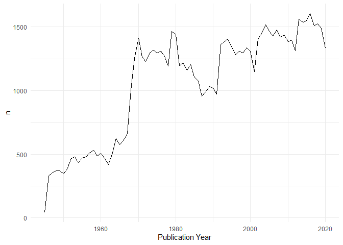
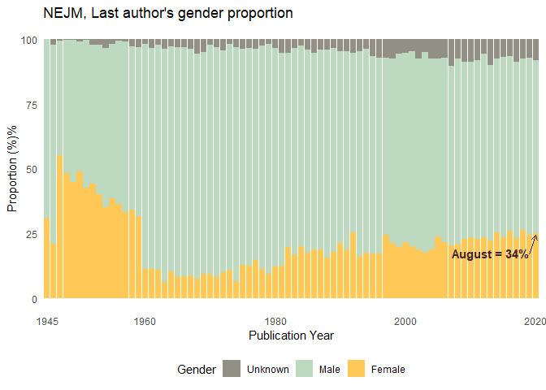

## Gender proportions in NEJM

Data was collected from all publications registered in pubmed, from the
New England Journal of Medicine, from 1945 to 2020. (Raw data available
at
[01\_data](https://github.com/palolili23/pubmed_webscrap/tree/master/01_data))

Since all publications only had first name initials, I used the package
[rcrossref](https://github.com/ropensci/rcrossref), function `cr_cn`,
which gets citation in various formats from CrossRef and only requires
the DOI. Before pulling the citations, I [registered for the Polite
Pool](https://github.com/ropensci/rcrossref#register-for-the-polite-pool)
as good practices, and requires setting my email account in the
Renviron. I used the `cr_cn` with the default setting, which pulls
article data in [bibtex](https://en.wikipedia.org/wiki/BibTeX) format,
which has complete names for all authors. The code for this step can be
found in
[`02_r/extract_bib`](https://github.com/palolili23/pubmed_webscrap/blob/master/02_r/extract_bib.R).
I did it in batches of \~10000 and saved the new dataframes with the
bibtex data as .Rda, they can be found at
[01b\_clean\_data](https://github.com/palolili23/pubmed_webscrap/tree/master/01b_clean_data).

Once all papers had their bibtex information, I followed the next steps
to clean the data:

``` r
library(tidyverse)
```

#### Steps to import the data:

``` r
data_dir <- "01b_clean_data"

rda_files <- fs::dir_ls(data_dir, regexp = "\\.Rda$")

data <- rda_files %>% 
  map_dfr(rio::import)

data <- data %>% 
  distinct(PMID, .keep_all = TRUE)

data %>% 
  select(DOI, bib) %>% 
  sample_n(3) %>% 
  mytable()
```

<table class="table table-hover table-condensed table-responsive" style="font-size: 12px; width: auto !important; margin-left: auto; margin-right: auto;">

<thead>

<tr>

<th style="text-align:left;">

DOI

</th>

<th style="text-align:left;">

bib

</th>

</tr>

</thead>

<tbody>

<tr>

<td style="text-align:left;">

10.1056/NEJM198209023071008

</td>

<td style="text-align:left;">

@article{Cabot\_1982, doi = {10.1056/nejm198209023071008}, url =
{<https://doi.org/10.1056%2Fnejm198209023071008>}, year = 1982, month =
{sep}, publisher = {Massachusetts Medical Society}, volume = {307},
number = {10}, pages = {605–614}, author = {Richard C. Cabot and Robert
E. Scully and Eugene J. Mark and Betty U. McNeely and L. Christine
Oliver and Eugene J. Mark}, title = {Case 35-1982}, journal = {New
England Journal of Medicine} }

</td>

</tr>

<tr>

<td style="text-align:left;">

10.1056/NEJM196507152730306

</td>

<td style="text-align:left;">

@article{Cathcart\_1965, doi = {10.1056/nejm196507152730306}, url =
{<https://doi.org/10.1056%2Fnejm196507152730306>}, year = 1965, month =
{jul}, publisher = {Massachusetts Medical Society}, volume = {273},
number = {3}, pages = {143–146}, author = {Edgar S. Cathcart and Francis
R. Comerford and Alan S. Cohen}, title = {Immunologic Studies on a
Protein Extracted from Human Secondary Amyloid}, journal = {New England
Journal of Medicine} }

</td>

</tr>

<tr>

<td style="text-align:left;">

10.1056/NEJMoa1314583

</td>

<td style="text-align:left;">

@article{Gopal\_2014, doi = {10.1056/nejmoa1314583}, url =
{<https://doi.org/10.1056%2Fnejmoa1314583>}, year = 2014, month = {mar},
publisher = {Massachusetts Medical Society}, volume = {370}, number =
{11}, pages = {1008–1018}, author = {Ajay K. Gopal and Brad S. Kahl and
Sven de Vos and Nina D. Wagner-Johnston and Stephen J. Schuster and
Wojciech J. Jurczak and Ian W. Flinn and Christopher R. Flowers and
Peter Martin and Andreas Viardot and Kristie A. Blum and Andre H. Goy
and Andrew J. Davies and Pier Luigi Zinzani and Martin Dreyling and Dave
Johnson and Langdon L. Miller and Leanne Holes and Daniel Li and Roger
D. Dansey and Wayne R. Godfrey and Gilles A. Salles}, title =
{{PI}3K\(\updelta\) Inhibition by Idelalisib in Patients with Relapsed
Indolent Lymphoma}, journal = {New England Journal of Medicine} }

</td>

</tr>

</tbody>

</table>

#### Extract authors name and make as many rows as authors, per paper

``` r
# Create an author variable from the bibtex
data <- data %>% mutate(
  author = str_extract(bib, "(author = \\{)(.)+"),
  author = str_remove(author, "author = \\{"),
  author = str_remove(author, "\\},")
)

## Separate authors into multiple columns using the split_into_multiple function. 
## Create as many rows as authors for each paper using pivot_longer

split_into_multiple <- function(column, pattern = ", ", into_prefix){
  cols <- str_split_fixed(column, pattern, n = Inf)
  cols[which(cols == "")] <- NA
  cols <- as_tibble(cols)
  m <- dim(cols)[2]
  
  names(cols) <- paste(into_prefix, 1:m, sep = "_")
  return(cols)
}

data_authors <- data %>% 
  bind_cols(split_into_multiple(data$author, " and ", "author")) %>% 
  pivot_longer(
    cols = starts_with("author_"),
    names_to = "author_position",
    values_to = "author_name",
    names_prefix = "author_") %>% 
  drop_na(author_name)


# Some authors only have initials instead of complete first names, these will be excluded
# Separate first and last name

data_authors <- data_authors %>% 
  mutate(author_clean = str_remove_all(author_name, "[:upper:][:punct:]"),
         author_clean = str_trim(author_clean, side = "both")) %>% 
  separate(author_clean, into = c("first_name", "last_name"), fill = "left")

data_filtered <- data_authors %>% 
  drop_na(first_name) 

data_filtered %>% 
filter(DOI == "10.1056/nejm194511152332004") %>% 
  select(author_position, author_name, first_name, last_name) %>% 
  mytable()
```

<table class="table table-hover table-condensed table-responsive" style="font-size: 12px; width: auto !important; margin-left: auto; margin-right: auto;">

<thead>

<tr>

<th style="text-align:left;">

author\_position

</th>

<th style="text-align:left;">

author\_name

</th>

<th style="text-align:left;">

first\_name

</th>

<th style="text-align:left;">

last\_name

</th>

</tr>

</thead>

<tbody>

<tr>

<td style="text-align:left;">

1

</td>

<td style="text-align:left;">

Elliot L. Sagall

</td>

<td style="text-align:left;">

Elliot

</td>

<td style="text-align:left;">

Sagall

</td>

</tr>

<tr>

<td style="text-align:left;">

2

</td>

<td style="text-align:left;">

Albert Dorfman

</td>

<td style="text-align:left;">

Albert

</td>

<td style="text-align:left;">

Dorfman

</td>

</tr>

</tbody>

</table>

#### Find gender for each author

To identify the gender of each author, I use the [`gender`
package](https://github.com/ropensci/gender), by Mullen, L. (2019).
gender: Predict Gender from Names Using Historical Data. R package
version 0.5.3 and the U.S. Social Security Administration baby names
database. To use the `gender` function, the package asks to download the
`genderdata` package, but installation can be tricky as discussed in
this [post](github.com/ropensci/drat/issues/6). I downloaded the package
using `devtools::install_github("ropensci/genderdata")` command.

*Considerations*: This package attempts to infer gender (or more
precisely, sex assigned at birth) based on first names using historical
data. This method has many limitations as discussed
[here](https://github.com/ropensci/gender#guidelines-and-warnings),
which include its reliance of data created by the state and its
inability to see beyond the state-imposed gender binary and is meant to
be used for studying populations in the aggregate. This method is a
rough approach and can missclassify gender or exclude individual
authors, but it can give a picture of the gender bias within the large
dataset.

``` r
names <- data_filtered %>% count(first_name) %>% pull(first_name)

gender <- gender::gender(names, method = "ssa")

data_filtered <- data_filtered %>% 
  left_join(gender, by = c("first_name" = "name")) %>% 
  select(-starts_with("proportion"),
         -starts_with("year"))

data_filtered %>% 
  select(first_name, gender) %>% 
  group_by(gender) %>% 
  sample_n(3) %>% 
  mytable()
```

<table class="table table-hover table-condensed table-responsive" style="font-size: 12px; width: auto !important; margin-left: auto; margin-right: auto;">

<thead>

<tr>

<th style="text-align:left;">

first\_name

</th>

<th style="text-align:left;">

gender

</th>

</tr>

</thead>

<tbody>

<tr>

<td style="text-align:left;">

Chantha

</td>

<td style="text-align:left;">

female

</td>

</tr>

<tr>

<td style="text-align:left;">

Saundra

</td>

<td style="text-align:left;">

female

</td>

</tr>

<tr>

<td style="text-align:left;">

Jean

</td>

<td style="text-align:left;">

female

</td>

</tr>

<tr>

<td style="text-align:left;">

Luc

</td>

<td style="text-align:left;">

male

</td>

</tr>

<tr>

<td style="text-align:left;">

Edwin

</td>

<td style="text-align:left;">

male

</td>

</tr>

<tr>

<td style="text-align:left;">

Charles

</td>

<td style="text-align:left;">

male

</td>

</tr>

<tr>

<td style="text-align:left;">

Joost

</td>

<td style="text-align:left;">

NA

</td>

</tr>

<tr>

<td style="text-align:left;">

Gultekin

</td>

<td style="text-align:left;">

NA

</td>

</tr>

<tr>

<td style="text-align:left;">

Beng

</td>

<td style="text-align:left;">

NA

</td>

</tr>

</tbody>

</table>

## Plot

Insight on the number of papers per year, and number of missing papers
with missing DOI

<!-- --><!-- -->

For the following plots I will make slight changes to the gender
variable:

``` r
data_filtered <- data_filtered %>% 
  mutate(
    `Publication Year` = as_factor(`Publication Year`),
    gender = ifelse(is.na(gender), "unknown", gender), 
    gender = ifelse(is.na(gender), "unknown", gender), 
    gender = str_to_title(gender)) 
```

## Gender proportion over time

``` r
count_gender <- data_filtered %>% 
  group_by(`Publication Year`) %>% 
  count(gender) %>% 
  mutate(prop = round(100*n/sum(n), 2)) %>% 
  ungroup()

count_gender %>%
  ggplot(aes(`Publication Year`, prop, fill = gender)) +
  geom_col() +
  scale_fill_manual(values = c("#FFC857", "#BDD9BF", "#929084")) +
  theme_minimal() +
  labs(title = "NEJM, author's gender proportion",
     y = "Proportion (%)%",
     fill = "Gender") +
  scale_x_discrete(breaks = c("1945", "1960", "1980", "2000", "2020")) +
    theme(legend.position = "bottom")
```

<!-- -->

## First author´s gender proportion over time

``` r
count_gender_first <- data_filtered %>% 
  filter(author_position == 1) %>% 
  group_by(`Publication Year`) %>% 
  count(gender) %>% 
  mutate(prop = round(100*n/sum(n), 2)) %>% 
  ungroup()

count_gender_first %>% 
  ggplot(aes(`Publication Year`, prop, fill = gender)) +
  geom_col() +
  scale_fill_manual(values = c("#FFC857", "#BDD9BF", "#929084")) +
  theme_minimal() +
  labs(
    title = "NEJM, first author's gender proportion",
    y = "Proportion (%)%",
    fill = "Gender") +
    scale_x_discrete(
    breaks=c("1945", "1960", "1980", "2000", "2020")) +
    theme(legend.position = "bottom")
```

<!-- -->

## Single author´s proportion over time

``` r
count_single <- data_filtered %>% 
  group_by(DOI) %>% 
  mutate(total_authors = last(author_position)) %>%
  ungroup() %>% 
  filter(total_authors == 1) %>% 
  group_by(`Publication Year`) %>% 
  count(gender) %>% 
  mutate(prop = round(100*n/sum(n), 2)) %>% 
  ungroup()

count_single %>% 
  ggplot(aes(`Publication Year`, prop, fill = gender)) +
  geom_col() +
  scale_fill_manual(values = c("#FFC857", "#BDD9BF", "#929084")) +
  theme_minimal() +
  labs(
    title = "NEJM, Single author's gender proportion",
    y = "Proportion (%)%",
    fill = "Gender") +
    scale_x_discrete(
    breaks=c("1945", "1960", "1980", "2000", "2020")
  ) +
    theme(legend.position = "bottom")
```

<!-- -->

## Last author’s gender proportion

``` r
count_last<- data_filtered %>% 
  group_by(DOI) %>% 
  filter(author_position == last(author_position)) %>%
  ungroup() %>% 
  group_by(`Publication Year`) %>% 
  count(gender) %>% 
  mutate(prop = round(100*n/sum(n), 2)) %>% 
  ungroup()

count_last %>% 
  ggplot(aes(`Publication Year`, prop, fill = gender)) +
  geom_col() +
  scale_fill_manual(values = c("#FFC857", "#BDD9BF", "#929084")) +
  theme_minimal() +
  labs(
    title = "NEJM, Last author's gender proportion",
    y = "Proportion (%)%",
    fill = "Gender") +
    scale_x_discrete(
    breaks=c("1945", "1960", "1980", "2000", "2020")
  ) +
    theme(legend.position = "bottom")
```

<!-- -->
